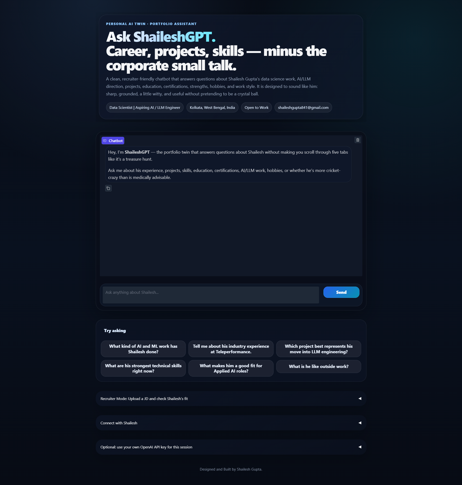
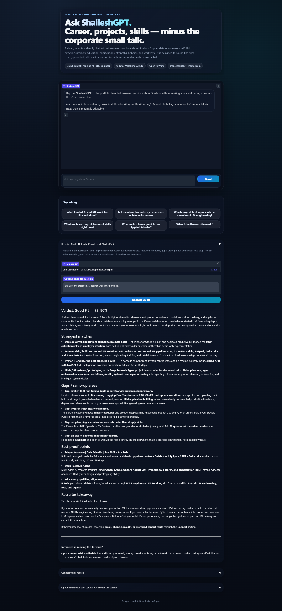

# 🚀 ShaileshGPT — AI-Powered Personal Portfolio Assistant


**Repository:** [https://github.com/sg2499/ShaileshGPT](https://github.com/sg2499/ShaileshGPT)

---

## 📌 What is ShaileshGPT?

**ShaileshGPT** is a full-stack AI-powered personal portfolio system that turns a static resume website into an interactive, recruiter-ready, AI-driven experience.

Instead of making visitors scroll through a resume, GitHub profile, LinkedIn profile, project cards, blog posts, and certifications manually, this project gives them a personalized AI assistant that can answer questions about:

- Professional Background
- Work Experience
- Technical Skills
- Education
- Certifications
- Portfolio Projects
- AI / LLM / RAG Work
- Hobbies and Personality
- Recruiter Fit
- Job-Description Alignment

The system also includes a **Recruiter Mode**, where a recruiter can upload a job description and ask whether the profile is a good fit for that role. The bot compares the uploaded JD with skills, experience, certifications, education, and projects, then gives a clear fit verdict, strengths, gaps, proof points, and a recruiter takeaway.

This project is not just a chatbot. It is a complete personal AI product.

---

## ⚠️ Important Note — Please Build Your Own Version

This repository uses **my personal knowledge base**.

That means the bot is grounded on information about **me — Shailesh Gupta**, including my:

- Resume
- Work Experience
- Projects
- Skills
- Certifications
- Education
- GitHub Work
- Portfolio Positioning
- Personal Interests
- Personality Traits
- Recruiter-Fit Logic

So please do **not** blindly copy this project and deploy it as-is.

Instead, use this repository as a **reference architecture** and build your own version with your own:

- Resume
- Profile Summary
- Projects
- Skills
- Education
- Certifications
- Personality Layer
- Professional Goals
- Deployment Configuration
- API Keys

The best way to use this project is to understand the system design and then rebuild a version that represents **you**.

> Take reference from my work, improve it, customize it, and make something better than mine.

That is the whole point of sharing this project.

---

## ⚠️ Important Note About API Usage and Public Access

This project uses paid third-party APIs:

- OpenAI API for chat, embeddings, routing, retrieval, and answer generation
- SendGrid API for email notifications
- Pushover API for instant lead notifications

Because of this, unrestricted public usage can increase API cost.

My personal website has ShaileshGPT integrated, and users can interact with the bot there. However, the app also includes an option where users can enter their **own OpenAI API key for the active session**.

This is useful because:

- It helps control my API costs
- Advanced users can test using their own credits
- Developers cloning the project can run it independently
- No one needs to depend on my private credentials

If you are cloning this project, please use **your own API keys**.

Never use someone else’s API key without permission.

---

## 🎯 Why This Project Exists

Most portfolio websites are static.

They show:

- About section
- Experience
- Skills
- Projects
- Resume download
- Contact links

That is useful, but passive.

ShaileshGPT changes the experience into something interactive.

A recruiter, founder, hiring manager, collaborator, or curious visitor can directly ask:

```text
What kind of AI and ML work has Shailesh done?
```

```text
Is Shailesh a good fit for an Applied AI Engineer role?
```

```text
Which project best proves his LLM engineering direction?
```

```text
Compare this JD with Shailesh's profile and tell me if he is a match.
```

The bot answers using a structured knowledge base instead of generic assumptions.

---

## 🧠 What Makes ShaileshGPT an Industry-Grade Product?

This is not a simple prompt wrapper.

It includes:

- Full-Stack Architecture
- React/Vite Portfolio Frontend
- FastAPI Backend
- Structured Personal Knowledge Base
- Agentic RAG Pipeline
- Vector Embeddings
- Hybrid Retrieval
- Streaming Responses
- JD-fit Analysis
- Recruiter Lead Capture
- SendGrid Email Notification
- Pushover Phone Notification
- Optional Session-Level OpenAI API Key
- Render Backend Deployment
- Vercel Frontend Deployment
- API Rate Limiting
- Public Website Integration

This makes it closer to a real-world AI product than a basic demo.

---

## ✨ Core Features

### 1. AI Portfolio Chatbot

Visitors can ask natural-language questions about my profile.

Example questions:

```text
What kind of AI and ML work has Shailesh done?
```

```text
Tell me about his Teleperformance experience.
```

```text
What are his strongest technical skills?
```

```text
What is he like outside work?
```

The bot responds in a polished, conversational, professional, slightly witty tone.

---

### 2. Agentic RAG Knowledge Base

The bot uses a structured knowledge base and retrieval pipeline.

The knowledge base includes:

- Identity Layer
- Professional Summary
- Skills
- Work Experience
- Education
- Certifications
- Projects
- Public Presence
- Interests
- Personal Profile
- Target Roles
- Strengths and Values
- Fun Facts
- FAQ Entries
- Raw Source Documents

The bot retrieves relevant context before answering instead of relying only on model memory.

---

### 3. Streaming Chat

The app streams responses token-by-token, giving a professional ChatGPT-like feel.

This makes the bot feel fast, modern, and interactive.

---

### 4. Recruiter JD-Fit Analysis

Recruiters can upload a job description in:

- PDF
- TXT
- MD
- CSV

The bot analyzes the JD against my profile and returns:

- Fit Verdict
- Realistic Fit Percentage Range
- Strongest Matches
- Gaps / Ramp-Up Areas
- Best Proof Points
- Recruiter Takeaway
- Contact CTA

Example verdict:

```text
Verdict: Good Fit — 72–80%
```

This is one of the most important features because it turns the bot into a recruiter-facing evaluation assistant.

---

### 5. Lead Capture

Visitors can leave their details:

- Name
- Email
- Phone
- LinkedIn Profile
- GitHub Profile
- Website
- Other Contact Route
- Message / Intent

Once submitted, the system sends a notification to me.

---

### 6. Pushover Notification

Pushover sends an instant notification to my phone whenever someone submits their contact details.

This is useful for real-time recruiter or collaborator alerts.

---

### 7. SendGrid Email Notification

SendGrid sends an email with the submitted lead details.

This creates a proper notification workflow and keeps a written record of recruiter/collaborator interest.

---

### 8. Optional User API Key

The app includes an option for a user to provide their own OpenAI API key for the active session.

This is useful for:

- Reducing owner-side API costs
- Allowing advanced users to test with their own credits
- Private/Local Demos
- Responsible public usage

The key is session-only and should not be written to disk.

---

### 9. Website Integration

The chatbot is integrated into the portfolio website as:

- A dedicated ShaileshGPT product section
- A floating chatbot widget
- A recruiter JD-fit tab
- A connect/contact tab
- A featured project card

This turns the portfolio into a working AI product.

---

## 🏗️ High-Level Architecture

```text
User / Recruiter
   ↓
React + Vite Portfolio Website
   ↓
Floating ShaileshGPT Widget
   ↓
FastAPI Backend
   ↓
Agentic RAG Pipeline
   ↓
OpenAI Chat + Embeddings
   ↓
Personal Knowledge Base
   ↓
Grounded Answer / JD Fit / Lead Capture
   ↓
SendGrid Email + Pushover Notification
```

---

## 🧩 System Components

### Frontend

Built with:

- React
- Vite
- Tailwind CSS

Main frontend responsibilities:

- Render portfolio website
- Display ShaileshGPT section
- Handle floating chatbot UI
- Stream chat responses
- Upload JD files
- Collect lead details
- Call FastAPI backend endpoints

---

### Backend

Built with:

- FastAPI
- Uvicorn
- OpenAI Python SDK
- Pydantic
- NumPy
- pypdf
- SendGrid via REST API
- Pushover via REST API

Main backend responsibilities:

- Build/Load knowledge base
- Embed profile chunks
- Perform retrieval
- Route queries
- Generate grounded responses
- Analyze uploaded JDs
- Capture leads
- Send notifications
- Rate-limit public API usage

---

### Knowledge Base

The knowledge base is created from structured profile files and source documents.

Important files:

```text
data/profile_seed.json
data/source_documents.json
data/raw/
```

`profile_seed.json` contains structured information about the person.

For your own version, this is the most important file to customize.

---

## 📁 Project Structure

A typical full project structure looks like this:

```bash
📦ShaileshGPT/
├── backend/
│   ├── api_server.py              # FastAPI API backend
│   ├── agentic_rag.py             # Agentic RAG orchestration
│   ├── knowledge_base.py          # Chunking, embeddings, retrieval
│   ├── build_kb.py                # Builds vector knowledge base
│   ├── prepare_sources.py         # Prepares source documents
│   ├── jd_matcher.py              # JD-fit analysis logic
│   ├── lead_utils.py              # Pushover + SendGrid lead notification
│   ├── widget.js                  # Optional standalone website widget
│   ├── requirements.txt           # Python backend dependencies
│   ├── runtime.txt                # Python version for Render
│   ├── .env.example               # Backend environment template
│   ├── data/
│   │   ├── profile_seed.json      # Structured personal knowledge base
│   │   ├── source_documents.json  # Prepared source documents
│   │   └── raw/
│   │       ├── resume.pdf
│   │       └── profile.pdf
│   └── assets/
│       └── PP.jpg                 # Profile picture
│
├── frontend/
│   ├── index.html                 # Website HTML metadata
│   ├── package.json               # Frontend dependencies
│   ├── postcss.config.js
│   ├── tailwind.config.js
│   ├── vite.config.js
│   ├── public/
│   │   ├── favicon.png
│   │   └── preview.png            # Social sharing preview image
│   └── src/
│       ├── App.jsx                # Main React portfolio + chatbot UI
│       ├── index.css              # Tailwind and custom styling
│       └── main.jsx               # React entry point
│
└── README.md
```

Depending on how you organize your repo, your files may be in one root folder or split into backend/frontend folders.

---

## 🚀 Backend Setup Guide

### 1. Clone the Repository

```bash
git clone https://github.com/sg2499/ShaileshGPT.git
cd ShaileshGPT
```

If your backend is inside a separate folder:

```bash
cd backend
```

---

## 🐍 Python Environment Setup

Use Python 3.11 for best compatibility.

### Option A — Using `venv`

**Windows**

```powershell
python -m venv venv
venv\Scripts\activate
```

**macOS / Linux**

```bash
python3 -m venv venv
source venv/bin/activate
```

Install dependencies:

```bash
pip install -r requirements.txt
```

---

### Option B — Using Conda

```bash
conda create -n shaileshgpt python=3.11 -y
conda activate shaileshgpt
pip install -r requirements.txt
```

---

### Option C — Using `uv`

```bash
uv venv
```

Activate:

**Windows**

```powershell
.venv\Scripts\Activate.ps1
```

**macOS / Linux**

```bash
source .venv/bin/activate
```

Install:

```bash
uv pip install -r requirements.txt
```

---

## 📦 Backend Dependencies

Typical backend dependencies:

```txt
openai
fastapi
uvicorn
python-dotenv
pydantic
requests
numpy
pypdf
python-multipart
```

Install with:

```bash
pip install -r requirements.txt
```

---

## 🔐 Backend Environment Variables

Create a `.env` file in the backend root.

Example:

```env
OPENAI_API_KEY=your_openai_api_key
OPENAI_CHAT_MODEL=gpt-4.1-mini
OPENAI_EMBEDDING_MODEL=text-embedding-3-small

PUSHOVER_USER=your_pushover_user_key
PUSHOVER_TOKEN=your_pushover_app_token

SENDGRID_API_KEY=your_sendgrid_api_key
SENDGRID_FROM_EMAIL=your_verified_sender_email@example.com
LEAD_FROM_EMAIL=your_verified_sender_email@example.com
LEAD_NOTIFY_EMAIL=your_email@example.com

RATE_LIMIT_REQUESTS=30
RATE_LIMIT_WINDOW_SECONDS=3600
ALLOWED_ORIGINS=*
```

---

# 🔑 API Key Setup Guides

---

## 🤖 OpenAI API Key Setup

The OpenAI API is used for:

- Query routing
- Query expansion
- Embeddings
- RAG answer generation
- JD-fit analysis

### Step 1 — Create an OpenAI Platform Account

Go to:

```text
https://platform.openai.com/
```

Sign in or create an account.

### Step 2 — Create an API Key

Go to:

```text
https://platform.openai.com/settings/organization/api-keys
```

Create a new secret key.

### Step 3 — Add Billing

OpenAI API usage requires billing to be enabled for paid API usage. Check your OpenAI Platform billing/settings before deploying publicly.

### Step 4 — Add API Key to `.env`

```env
OPENAI_API_KEY=your_openai_api_key_here
```

### Step 5 — Never Commit Your Key

Do not push `.env` to GitHub.

Add this to `.gitignore`:

```gitignore
.env
```

### Optional — Use Your Own Key in the App

The UI includes an optional session key input.

This lets users run the conversation on their own OpenAI credits.

If you are testing my deployed website and want to avoid using my API quota, you can use your own key through that option.

---

## 📬 SendGrid API Key Setup

SendGrid is used for email notifications when someone submits their contact details.

### Step 1 — Create a SendGrid Account

Go to:

```text
https://sendgrid.com/
```

Create an account and complete onboarding.

### Step 2 — Verify Sender Identity

SendGrid requires sender identity verification before email sending.

You can use either:

### Option A — Single Sender Verification

Best for testing.

Use this if:

- You only need one sender email
- You want quick setup
- You do not want to configure DNS records

### Option B — Domain Authentication

Best for production.

Use this if:

- You own a domain
- You can update DNS records
- You want better deliverability
- You want emails to look more professional

### Step 3 — Create SendGrid API Key

Inside SendGrid:

```text
Settings → API Keys → Create API Key
```

Recommended permission:

```text
Mail Send
```

### Step 4 — Add SendGrid Variables to `.env`

```env
SENDGRID_API_KEY=your_sendgrid_api_key
SENDGRID_FROM_EMAIL=your_verified_sender_email@example.com
LEAD_FROM_EMAIL=your_verified_sender_email@example.com
LEAD_NOTIFY_EMAIL=your_email@example.com
```

Important:

`SENDGRID_FROM_EMAIL` / `LEAD_FROM_EMAIL` must be verified in SendGrid.

---

## 🔔 Pushover API Key Setup

Pushover is used for instant phone notifications when someone leaves their contact details.

### Step 1 — Create a Pushover Account

Go to:

```text
https://pushover.net/
```

Create an account and install the Pushover app on your phone.

### Step 2 — Get Your User Key

After logging in, your user key is visible in your Pushover dashboard.

Add it to `.env`:

```env
PUSHOVER_USER=your_pushover_user_key
```

### Step 3 — Create a Pushover Application

Go to the Pushover application/API section and create a new application.

Example app name:

```text
ShaileshGPT Lead Bot
```

After creating the app, Pushover gives you an API token.

Add it to `.env`:

```env
PUSHOVER_TOKEN=your_pushover_app_token
```

### Step 4 — Test Lead Capture

Run the backend, open the app, submit contact details, and check whether your phone receives a notification.

---

## 🧠 Customize the Knowledge Base for Yourself

This is the most important part if you want to build your own version.

Do not keep my personal profile data.

Edit:

```text
data/profile_seed.json
```

Replace my information with yours.

Suggested structure:

```json
{
  "identity": {
    "name": "Your Name",
    "headline": "Your Professional Headline",
    "location": "Your Location",
    "email": "your_email@example.com",
    "github": "https://github.com/your_username",
    "linkedin": "https://linkedin.com/in/your_profile",
    "website": "https://yourwebsite.com",
    "blog": "https://yourblog.com"
  },
  "professional_summary": [
    "Write a concise summary of your professional background."
  ],
  "skills": {
    "ml_ai": ["Machine Learning", "LLMs", "RAG"],
    "programming": ["Python", "JavaScript"],
    "deployment": ["FastAPI", "Vercel", "Render"]
  },
  "experience": [],
  "education": [],
  "certifications": [],
  "projects": [],
  "interests": [],
  "personal_profile": [],
  "strengths_and_values": [],
  "fun_facts": []
}
```

Also replace documents inside:

```text
data/raw/
```

with your:

- Resume
- LinkedIn Export/Profile PDF
- Portfolio Notes
- Project Descriptions

Then rebuild the knowledge base.

---

## 🏗️ Build the Knowledge Base

After editing your profile data:

```bash
python build_kb.py
```

This will prepare source documents, create embeddings, and save the index.

Expected output:

```text
Knowledge base built successfully
```

If this step fails, check:

- `OPENAI_API_KEY` is set
- `data/profile_seed.json` exists
- Python environment is active
- Dependencies are installed

---

## ▶️ Run Backend Locally

Start the FastAPI backend:

```bash
uvicorn api_server:app --host 0.0.0.0 --port 8000 --reload
```

Test health endpoint:

```text
http://localhost:8000/health
```

Expected:

```json
{"status":"ok"}
```

---

## 🧪 Backend API Endpoints

### Health Check

```http
GET /health
```

Returns:

```json
{"status":"ok"}
```

---

### Chat Stream

```http
POST /chat_stream
```

Used by the website frontend to stream chatbot responses.

---

### JD Fit Analysis

```http
POST /jd_fit
```

Accepts:

- Job description file
- Optional recruiter question

Supported file types:

- PDF
- TXT
- MD
- CSV

---

### Lead Capture

```http
POST /lead
```

Captures:

- Name
- Email
- Phone Number
- LinkedIn
- GitHub
- Website
- Other contact
- Message

Then sends:

- Pushover notification
- SendGrid email

---

## 🌐 Frontend Setup Guide

The frontend is a React + Vite portfolio website.

If your frontend is inside a separate folder:

```bash
cd frontend
```

Install dependencies:

```bash
npm install
```

Create a frontend `.env` file:

```env
VITE_SHAILESHGPT_API_BASE=http://localhost:8000
```

Run locally:

```bash
npm run dev
```

Open the local Vite URL in your browser.

---

## 🌍 Deployment Guide

This project uses two deployments:

| Layer | Platform | Purpose |
|---|---|---|
| Backend | Render | FastAPI + OpenAI + RAG + notifications |
| Frontend | Vercel | React portfolio website |

---

## 🚀 Deploy Backend on Render

### Step 1 — Push Backend to GitHub

Make sure your backend folder contains:

```text
api_server.py
agentic_rag.py
build_kb.py
knowledge_base.py
prepare_sources.py
jd_matcher.py
lead_utils.py
requirements.txt
runtime.txt
data/profile_seed.json
```

Push to GitHub.

---

### Step 2 — Create Render Web Service

On Render:

```text
New → Web Service
```

Select your backend repo.

### Step 3 — Render Settings

Use:

```text
Build Command:
pip install -r requirements.txt
```

```text
Start Command:
uvicorn api_server:app --host 0.0.0.0 --port $PORT
```

### Step 4 — Add Render Environment Variables

Add:

```env
OPENAI_API_KEY=your_openai_api_key
OPENAI_CHAT_MODEL=gpt-4.1-mini
OPENAI_EMBEDDING_MODEL=text-embedding-3-small
ALLOWED_ORIGINS=*
```

Optional:

```env
PUSHOVER_USER=your_pushover_user_key
PUSHOVER_TOKEN=your_pushover_app_token
SENDGRID_API_KEY=your_sendgrid_api_key
SENDGRID_FROM_EMAIL=your_verified_sender_email@example.com
LEAD_FROM_EMAIL=your_verified_sender_email@example.com
LEAD_NOTIFY_EMAIL=your_email@example.com
RATE_LIMIT_REQUESTS=30
RATE_LIMIT_WINDOW_SECONDS=3600
```

### Step 5 — Test Backend

After deployment, open:

```text
https://your-render-service.onrender.com/health
```

Expected:

```json
{"status":"ok"}
```

If the root URL returns:

```json
{"detail":"Not Found"}
```

that is normal unless you add a custom `/` route.

---

## ▲ Deploy Frontend on Vercel

### Step 1 — Push Frontend to GitHub

Your frontend folder should contain:

```text
index.html
package.json
postcss.config.js
tailwind.config.js
vite.config.js
public/
src/
```

### Step 2 — Import Project into Vercel

Go to Vercel and import the repo.

### Step 3 — Add Vercel Environment Variable

```env
VITE_SHAILESHGPT_API_BASE=https://your-render-service.onrender.com
```

### Step 4 — Build Settings

Vercel usually detects Vite automatically.

Typical settings:

```text
Build Command: npm run build
Output Directory: dist
Install Command: npm install
```

### Step 5 — Redeploy

After adding the environment variable, redeploy the site.

---

## 🧪 Testing Checklist

After deployment, test the following:

### Backend

- [ ] `/health` returns `{"status":"ok"}`
- [ ] backend logs show no missing API key
- [ ] no CORS error in browser console

### Frontend

- [ ] website loads normally
- [ ] ShaileshGPT section appears
- [ ] floating chat button appears
- [ ] chat streams responses
- [ ] JD upload works
- [ ] lead capture works
- [ ] SendGrid email arrives
- [ ] Pushover phone notification arrives
- [ ] preview image appears when sharing the website link

---

## 🧪 Troubleshooting Guide

### 1. `{"detail":"Not Found"}` on Render root URL

This is normal if you open:

```text
https://your-render-service.onrender.com
```

Use:

```text
https://your-render-service.onrender.com/health
```

---

### 2. `OPENAI_API_KEY is missing`

Cause:

- backend environment variable is not set

Fix:

- add `OPENAI_API_KEY` in `.env` locally
- add it in Render environment variables for deployment

---

### 3. `data/profile_seed.json` missing

Cause:

- required knowledge base seed file is not present

Fix:

- add `data/profile_seed.json`
- use your own profile data
- redeploy

---

### 4. `data/source_documents.json` missing

Cause:

- source document folder/file was not created

Fix:

- run `python build_kb.py`
- ensure `prepare_sources.py` creates the `data/` folder
- ensure your deployment includes the `data/` directory

---

### 5. Chatbot does not respond on website

Possible causes:

- `VITE_SHAILESHGPT_API_BASE` is missing
- Backend is asleep or down
- CORS issue
- Wrong Render URL
- Backend route unavailable

Fix:

- Check browser console
- Open `/health`
- Verify Vercel env var
- Redeploy frontend after changing env var

---

### 6. JD Upload Fails

Possible causes:

- Unsupported file type
- Backend missing `python-multipart`
- File too large
- Backend error

Fix:

- Upload PDF/TXT/MD/CSV
- Install `python-multipart`
- Check Render logs

---

### 7. SendGrid Email Does Not Arrive

Possible causes:

- Unverified sender email
- Wrong SendGrid API key
- Missing Mail Send permission
- Email went to spam

Fix:

- Verify sender identity
- Check SendGrid dashboard
- Confirm env vars
- Check Render logs

---

### 8. Pushover Notification Does Not Arrive

Possible causes:

- Wrong user key
- Wrong app token
- Pushover app not installed
- Device not enabled

Fix:

- Check Pushover dashboard
- Confirm `PUSHOVER_USER`
- Confirm `PUSHOVER_TOKEN`
- Send a test notification from Pushover

---

### 9. Vercel Build Fails

Possible causes:

- Wrong Node version
- Missing dependencies
- Incorrect file paths
- JSX syntax issue

Fix:

- Run locally first with `npm run build`
- Check Vercel logs
- Confirm `src/App.jsx`, `src/main.jsx`, and `src/index.css` exist

---

### 10. Social Preview Image Does Not Update

Possible causes:

- Social platforms cache previews
- Wrong `og:image`
- Image not in `public/preview.png`

Fix:

- Confirm `public/preview.png` exists
- Confirm `index.html` contains Open Graph tags
- Use LinkedIn Post Inspector or social preview debugger
- Wait for cache refresh

---

## 🔒 Security Notes

- Never commit `.env`
- Never expose OpenAI keys in frontend code
- Never put SendGrid keys in React/Vite frontend
- Keep API keys only on the backend
- Use environment variables in Render/Vercel
- Enable rate limiting
- Keep lead-capture endpoints protected from abuse
- Monitor usage and billing
- Rotate keys if exposed accidentally

---

## 💰 Cost Control Tips

This project can consume API credits.

To control costs:

- Use rate limiting
- Keep model choices reasonable
- Avoid exposing unrestricted backend usage
- Monitor OpenAI usage dashboard
- Encourage users to use their own OpenAI API key when testing
- Keep JD analysis concise
- Add authentication if scaling publicly

The UI includes an optional OpenAI API key field so advanced users can run the session with their own key.

---

## 📸 Screenshots





---

## 📚 Learning Value

By studying or rebuilding this project, you can learn:

- How to convert a portfolio website into an AI product
- How Agentic RAG works in a personal chatbot
- How to build structured personal knowledge bases
- How to stream LLM responses into a frontend
- How to analyze uploaded files with a backend
- How to build recruiter-facing AI tools
- How to integrate SendGrid and Pushover
- How to deploy a full-stack AI app using Render and Vercel
- How to control API cost and manage secrets

---

## 🚧 Future Improvements

Possible upgrades:

- Add login/authentication for admin mode
- Add a dashboard to view submitted leads
- Save conversation history to a database
- Add analytics for most asked questions
- Add admin UI to update knowledge base
- Add automatic GitHub/blog ingestion
- Add downloadable JD-fit reports
- Add PDF export for recruiter analysis
- Add voice input
- Add multilingual support
- Add usage-based cost tracking
- Add custom fine-tuned response style

---

## ✅ Final Advice for Builders

If you want to build your own version:

1. Do not copy my profile data.
2. Replace the knowledge base with your own story.
3. Keep the architecture.
4. Improve the UX.
5. Add your own personality.
6. Use your own API keys.
7. Deploy responsibly.
8. Build something better.

This project is meant to prove one idea:

> Your portfolio does not have to be a static page. It can be a living AI product that represents you.

---

## ✍️ Author

Created and built by **Shailesh Gupta**

- GitHub: [sg2499](https://github.com/sg2499)
- LinkedIn: [Shailesh Gupta](https://www.linkedin.com/in/shailesh-gupta-7b7278188)
- Blog: [Prismatic Metrics](https://prismatic-metrics.blogspot.com/)
- Portfolio: [Personal Website](https://personal-portfolio-ten-virid-75.vercel.app/)
- Email: shaileshgupta841@gmail.com

---

## ⭐ Support

If this project helps you understand how to build an AI-powered portfolio, consider giving the repository a star.

More importantly, build your own version and make it better.

---

> Built with ambition, caffeine, cricket-level obsession, and enough Agentic RAG to make a static resume feel nervous.
